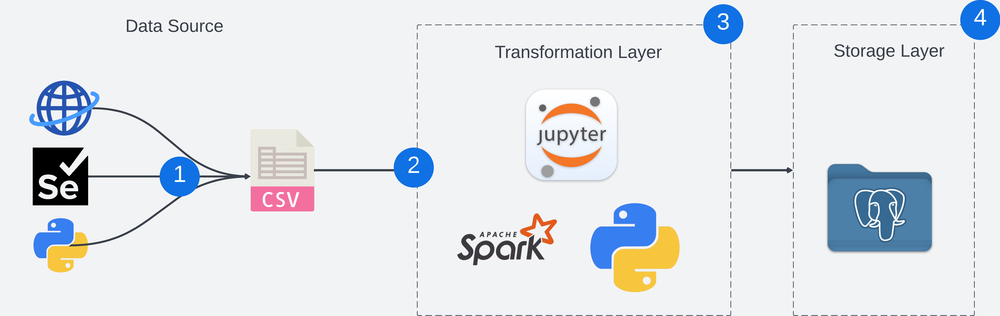

# PySpark_Projects

This repository contains all of my personal projects related to PySpark, a python API build for Apache Spark.

## Project 1: Google Play Store Apps Data Analysis

### Project Description

- This

### Technology Choices

- **PySpark** was chosen due to its large-scale data analysis capabilities and rich
- **Jupyter Notebook** is used to create interactive notebook documents that can contain live code, equations, visualizations, media and other computational outputs. Jupyter Notebook is often used by programmers, data scientists and students to document and demonstrate coding workflows or simply experiment with code.

## Project 2: FOREX Rates ETL with PySpark and Postgres

### Project Description

- This

### Solution Architecture

### Workflow

1. Using the `selenium` python library, exchange rates data are scraped from [Bangko Sentral ng Pilipinas](https://www.bsp.gov.ph/sitepages/statistics/exchangerate.aspx) official website. The scraped data will be saved in `/data/raw/rates` as `exchange_rates_[timestamp].csv`.
2. A jupyter notebook runs spark code that will consume and perform all the necessary transformations required for our scraped data before persisting it into a table inside a relational database.
3.

### Technology Choices

- **PySpark**
- **Jupyter Notebook** is used to create interactive notebook documents that can contain live code, equations, visualizations, media and other computational outputs. Jupyter Notebook is often used by programmers, data scientists and students to document and demonstrate coding workflows or simply experiment with code.

### Use cases

- Monitor both local and foreign exchange rate movements and changes
- Visualize trends, track rate changes overtime
